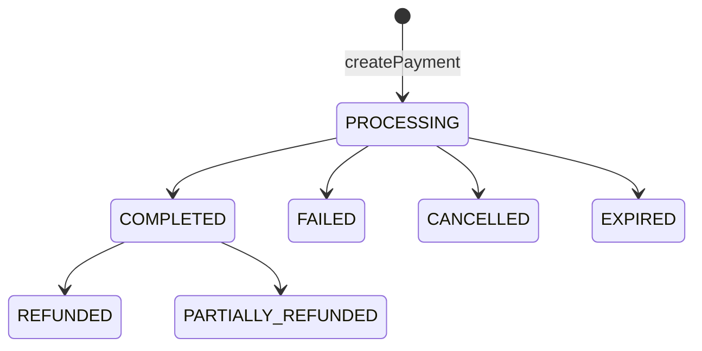

# Payment Flow — transactions subgraph

> The subgraph is the **source of truth** for the Order → Payment lifecycle. It
> owns the DB, runs the provider adapters, maps provider results to canonical
> status, and flips the Order. The gateway and web app never mutate payment
> state directly — they call the mutations here.
>
> Full cross-repo picture + diagrams: [`ekoru-web-app/docs/PAYMENT_FLOW.md`](../../ekoru-web-app/docs/PAYMENT_FLOW.md).
> Gateway edge: [`ekoru-gateway/docs/PAYMENT_FLOW.md`](../../ekoru-gateway/docs/PAYMENT_FLOW.md).
> Schema/env changelog: [`CHECKOUT.md`](./CHECKOUT.md).
> Queue/Redis (refunds, deploy & env): [`QUEUES.md`](./QUEUES.md).

Code: [`src/payments/`](../src/payments/) · [`src/orders/`](../src/orders/)

---

## 1. GraphQL surface

| Operation | Type | Auth | Purpose |
|---|---|---|---|
| `createOrder(input)` | mutation | buyer JWT (`@CurrentSeller`) | Build a `PENDING_PAYMENT` order with server-computed totals. |
| `createPayment(input)` | mutation | buyer JWT | Create a `PROCESSING` Payment + get the provider redirect. |
| `payment(id)` / `getPayment(id)` | query | public | Confirmation-screen polling. |
| `getPaymentsByPayer/Receiver` | query | — | History. |
| `refundPayment(input)` | mutation | — | Queue a refund (BullMQ). |
| `processProviderReturn(provider, payload, internalSecret)` | mutation | `INTERNAL_SERVICE_SECRET` | Gateway callback for provider **returns**. |
| `processProviderWebhook(provider, eventType, payload, internalSecret)` | mutation | `INTERNAL_SERVICE_SECRET` | Gateway callback for provider **webhooks**. |
| `createPaymentConfig(input)` | mutation | seller | Per-seller provider credentials. |

Internal-mutation auth: [`payments.resolver.ts`](../src/payments/payments.resolver.ts) `_assertInternal` checks `ctx.internalSecret` (from the `x-internal-secret` header, set in [`app.module.ts`](../src/app.module.ts) context) **or** the explicit `internalSecret` arg (dev curls). Missing `INTERNAL_SERVICE_SECRET` env → throws; mismatch → `Unauthorized`.

---

## 2. `createPayment` internals

[`payments.service.ts`](../src/payments/payments.service.ts) `createPayment`:

1. Reject if no `payerId` (JWT).
2. Load Order; assert `order.buyerId === payerId` and `order.status === PENDING_PAYMENT`.
3. Resolve the seller's active `ChileanPaymentConfig` for `input.provider` → else `El vendedor no tiene <PROVIDER> configurado`.
4. Insert a `Payment` (`PROCESSING`) — done first so its `id` is available as the provider reference. **Amount/currency/receiver come from the Order**, never input.
5. `ProviderRegistry.for(provider).initiate({...})` — **synchronous** (the redirect URL is what the buyer is waiting on). On throw → Payment flipped to `FAILED` with `failureReason`, error rethrown.
6. Persist `externalId` / `externalToken`, write a `PaymentTransaction{action: INITIATE}` audit row.
7. Return `CreatePaymentResult { paymentId, provider, status, redirect, payment }`.

BullMQ (`payments` queue) is reserved for **async reconciliation** (refunds), not the create path.

---

## 3. Return & webhook handling

### `handleProviderReturn`
1. `_findPaymentForReturn(provider, payload)` locates the `Payment`:
   - Webpay normal return carries only `token_ws` → looked up by `externalToken`.
   - Abort/timeout carry `TBK_ORDEN_COMPRA` (our `externalId`).
   - Other providers → `externalId` via `_extractExternalId`.
   (Token-first avoids a `findFirst({ externalId: undefined })` matching a random row.)
2. Load the payment's `ChileanPaymentConfig`.
3. `adapter.confirm({ paymentId, externalId, externalToken, config, rawPayload })`.
4. `_applyTerminalStatus(...)` persists status + flips the Order.

### `handleProviderWebhook`
Persists a `PaymentWebhook` audit row (even if the payment can't be matched), then `adapter.handleWebhook(payload)`; applies terminal status only when the payment is found and status ≠ `PROCESSING`.

### `_applyTerminalStatus` (idempotent)
```
COMPLETED  → Payment.status=COMPLETED, processedAt=now(), Order.markPaid(orderId)
FAILED     → Payment.status=FAILED  (+failureReason), Order.markCanceled(orderId)
CANCELLED  → Payment.status=CANCELLED,                 Order.markCanceled(orderId)
EXPIRED    → Payment.status=EXPIRED,                   Order.markCanceled(orderId)
PROCESSING → no terminal transition
```
`markCanceled` uses `updateMany({ where: { status: PENDING_PAYMENT } })`, so a late failure callback never downgrades a `PAID` order. Every call also appends a `PaymentTransaction{action: STATUS}` audit row.

---

## 4. Adapter contract <a id="adapter-contract"></a>

Every provider implements [`ProviderAdapter`](../src/payments/providers/provider-adapter.ts). The service holds one adapter per `ChileanPaymentProvider` and dispatches via [`ProviderRegistry`](../src/payments/providers/index.ts). The adapter is the **only** place a provider SDK is imported (lazy-loaded).

```ts
interface ProviderAdapter {
  initiate(args: InitiatePaymentArgs): Promise<InitiatePaymentResult>;
  confirm(args: ConfirmPaymentArgs): Promise<ConfirmPaymentResult>;      // return-URL
  handleWebhook(payload: Record<string, unknown>): Promise<ConfirmPaymentResult>;
}

// InitiatePaymentArgs: { paymentId, orderId, amount, currency, description, returnUrl,
//   config: { environment, merchantId, apiKey, secretKey } }
// InitiatePaymentResult: { externalId, externalToken, redirect: WEBPAY_FORM | EXTERNAL }
// ConfirmPaymentResult:  { status: COMPLETED|FAILED|CANCELLED|EXPIRED|PROCESSING, raw }
```

### Webpay return classification ([`webpay.adapter.ts`](../src/payments/providers/webpay.adapter.ts))

| `token_ws` | `TBK_TOKEN` | Action | Status |
|:-:|:-:|---|---|
| ✓ | — | `tx.commit(token_ws)` → `AUTHORIZED && response_code===0` | `COMPLETED` else `FAILED` |
| — | ✓ | none (never authorized) | `CANCELLED` |
| — | — | none (form timeout) | `EXPIRED` |
| ✓ | ✓ | none (abnormal) | `FAILED` |

SANDBOX uses `IntegrationCommerceCodes.WEBPAY_PLUS` + integration API key; PRODUCTION uses the seller's `merchantId`/`secretKey`. Webpay has no webhook (`handleWebhook` is a `PROCESSING` no-op).

### MercadoPago ([`mercadopago.adapter.ts`](../src/payments/providers/mercadopago.adapter.ts))
`initiate` creates a Preference → `EXTERNAL` redirect (`sandbox_init_point` in SANDBOX). Webhook-authoritative; the gateway passes the resolved status in `payload.__status`. Builds `notification_url` from `GATEWAY_BASE_URL`. SDK loaded via a non-literal specifier so the subgraph compiles/boots without the package installed.

---

## 5. Status enums

- **`PaymentStatus`**: `PENDING · PROCESSING · COMPLETED · FAILED · CANCELLED · REFUNDED · PARTIALLY_REFUNDED · EXPIRED`
- **`OrderStatus`**: `PENDING_PAYMENT · PAID · CANCELED · REFUNDED`
- **`ChileanPaymentProvider`**: `KHIPU · WEBPAY · MERCADOPAGO`
- **`PaymentEnvironment`**: `SANDBOX · PRODUCTION`



---

## 6. Adding a provider (subgraph checklist)

1. **Enum** — add to `ChileanPaymentProvider` in the **master** `prisma/schema.prisma` and in [`src/graphql/enums/index.ts`](../src/graphql/enums/index.ts). Run `node scripts/generate-schemas.js` (root) then `npx prisma generate` (here).
2. **Adapter** — new file in [`src/payments/providers/`](../src/payments/providers/) implementing `ProviderAdapter`; lazy-load the SDK.
3. **Registry** — add a `case` in `ProviderRegistry.for()` and list the adapter in [`payments.module.ts`](../src/payments/payments.module.ts).
4. **ID resolution** — add `case`s in `_extractExternalId` and `_findPaymentForReturn` so returns/webhooks resolve to the `Payment`.
5. **Config** — sellers add a `ChileanPaymentConfig` row (`createPaymentConfig`) with the provider's credentials; no code path change to switch a seller onto it.

`ChileanPaymentConfig` credential mapping: `merchantId` = commerce code (Webpay) / receiver id (Khipu); `apiKey` = Khipu/Webpay commerce key; `secretKey` = Webpay signing secret / MercadoPago access token / webhook secret. `apiKey`/`secretKey` are **write-only** (never selected back into GraphQL responses).

---

## 7. Env vars

```ini
PORT=4007
DATABASE_URL=postgres://…
MARKETPLACE_URL=http://localhost:4002/graphql   # createOrder canonical prices
STORES_URL=http://localhost:4003/graphql
GATEWAY_BASE_URL=http://localhost:4000          # provider webhook URLs (MercadoPago/Khipu)
INTERNAL_SERVICE_SECRET=<identical to ekoru-gateway>
REDIS_HOST=localhost
REDIS_PORT=6379
```
Provider credentials live on `ChileanPaymentConfig` rows, **not** env. For SANDBOX Webpay a seller can leave `merchantId`/`secretKey` null — the adapter falls back to Transbank's shared integration credentials.
