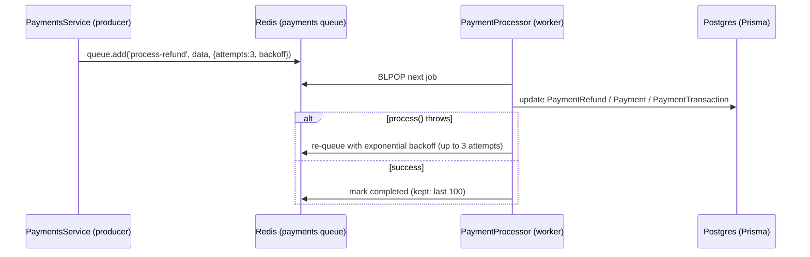

# Queues (BullMQ + Redis) — transactions subgraph

> This subgraph runs a **background job queue** for async payment reconciliation
> (today: refunds). It uses [BullMQ](https://docs.bullmq.io) via
> [`@nestjs/bullmq`](https://docs.nestjs.com/techniques/queues), backed by
> **Redis**. Redis is the only external dependency the queue needs — there is no
> hosted "queue service" to sign up for; you run/point at a Redis instance and
> set three env vars.
>
> Runtime payment reference: [`PAYMENT_FLOW.md`](./PAYMENT_FLOW.md) · Env
> changelog: [`CHECKOUT.md`](./CHECKOUT.md).

Code: [`src/queues/`](../src/queues/) · [`src/app.module.ts`](../src/app.module.ts) · [`src/payments/payments.service.ts`](../src/payments/payments.service.ts)

---

## 1. What actually runs

There is **one queue**, named `payments` (the constant
[`PAYMENT_QUEUE`](../src/payments/payments.service.ts) = `'payments'`). Three
pieces wire it together:

| Role | Where | What it does |
|---|---|---|
| **Connection** | [`app.module.ts`](../src/app.module.ts) `BullModule.forRootAsync` | Opens the shared Redis connection from `REDIS_*` env. Every queue/worker reuses it. |
| **Producer** | [`payments.service.ts`](../src/payments/payments.service.ts) — `@InjectQueue(PAYMENT_QUEUE)` | Calls `queue.add('job-name', data, opts)` to enqueue work. |
| **Consumer (worker)** | [`queues/processors/payment.processor.ts`](../src/queues/processors/payment.processor.ts) — `@Processor(PAYMENT_QUEUE)` | Picks jobs off Redis and runs `process(job)`. |

`BullModule.registerQueue({ name: 'payments' })` is declared **twice** on
purpose: in [`payments.module.ts`](../src/payments/payments.module.ts) (so the
service can inject the producer) and in
[`queues.module.ts`](../src/queues/queues.module.ts) (so the processor can attach
the worker). Same queue, two sides.



---

## 2. Job types

`process(job)` dispatches on `job.name`
([payment.processor.ts](../src/queues/processors/payment.processor.ts)):

| Job name | Payload | Produced today? | Handler effect |
|---|---|:-:|---|
| `process-refund` | `{ refundId, paymentId, amount, provider }` | ✅ `refundPayment()` | Marks refund `COMPLETED`, payment `REFUNDED`, writes audit row. |
| `initiate-payment` | `{ paymentId, provider, amount, … }` | ❌ reserved | Handler exists, but `createPayment` initiates the provider **synchronously** (buyer is waiting on the redirect URL). Not currently enqueued. |
| `process-webhook` | `{ webhookId }` | ❌ reserved | Handler exists, but returns/webhooks are reconciled synchronously in `handleProviderReturn` / `handleProviderWebhook`. Not currently enqueued. |

So in the current codebase the queue carries **refund jobs only**. The other two
handlers are scaffolding for moving those flows async later — they cost nothing
until something calls `queue.add()` with those names.

**Retries / backoff** — set per-job by the producer. Refunds use:

```ts
await this.paymentQueue.add(
  'process-refund',
  { refundId, paymentId, amount, provider },
  { attempts: 3, backoff: { type: 'exponential', delay: 3000 } }, // 3s, 6s, 12s
);
```

If `process()` throws, BullMQ re-queues the job until `attempts` is exhausted,
then it lands in the **failed** set. Handlers re-throw after marking the row
`FAILED` so a transient provider error still gets retried.

**Job retention** — [`app.module.ts`](../src/app.module.ts) `defaultJobOptions`:
`removeOnComplete: 100` (keep last 100 done), `removeOnFail: 500` (keep last 500
failed for debugging). These accumulate in Redis; size Redis accordingly.

---

## 3. Redis requirements

- **Version:** Redis **≥ 6.2** (BullMQ 5). Use **7.x** — the examples below pin
  `redis:7-alpine`.
- **Eviction policy:** must be `noeviction`. BullMQ stores job state as Redis
  keys; any `allkeys-*`/`volatile-*` eviction policy can silently drop jobs.
  Managed providers sometimes default to `allkeys-lru` — check and change it.
- **Persistence:** enable AOF (`--appendonly yes`) if you don't want queued/
  in-flight jobs lost on a Redis restart. For refunds this matters.
- **One Redis, one logical DB** is plenty — throughput here is low (a job per
  refund). No clustering needed.

---

## 4. Env vars

Read in [`app.module.ts`](../src/app.module.ts) via `ConfigService`:

```ini
REDIS_HOST=localhost   # hostname of Redis. In prod/staging: the compose Redis
                       # service name (see §6). Local dev: localhost.
REDIS_PORT=6379        # default 6379
REDIS_PASSWORD=        # optional locally; REQUIRED in prod/staging
```

Defaults if unset: `host='localhost'`, `port=6379`, `password=undefined`
(`configService.get('REDIS_HOST', 'localhost')`, etc.).

Set per environment:

| File | `REDIS_HOST` | Network (compose) |
|---|---|---|
| [`.env`](../.env) (dev) | `localhost` | — (host Redis, §5a) |
| [`.env.staging`](../.env.staging) | `ekoru-transactions-redis-staging` | `ekoru-staging-network` |
| [`.env.prod`](../.env.prod) | `ekoru-transactions-redis` | `ekoru-network` |

> `REDIS_PASSWORD` is a **secret** — the committed env files hold a placeholder.
> The real value lives only in the server-side secret files the Jenkins deploy
> copies over (`/opt/ekoru/secrets/ekoru-transactions/.env.{staging,prod}`, §6).
> The same env file feeds both the app and its Redis container, so the password
> is defined once.

Only `host` / `port` / `password` are wired. If you later use a **managed
provider that requires TLS** (Upstash, Azure Cache for Redis, etc.), add a `tls`
field to the connection factory in [`app.module.ts`](../src/app.module.ts):

```ts
connection: {
  host: configService.get('REDIS_HOST', 'localhost'),
  port: configService.get<number>('REDIS_PORT', 6379),
  password: configService.get('REDIS_PASSWORD'),
  ...(configService.get('REDIS_TLS') === 'true' ? { tls: {} } : {}),
},
```

---

## 5. Getting Redis (you have no account yet)

You don't need a Redis account or hosted plan — pick one path.

### 5a. Local development (recommended: Docker)

```bash
# throwaway, no password — matches the committed .env defaults
docker run -d --name ekoru-redis -p 6379:6379 redis:7-alpine \
  redis-server --maxmemory-policy noeviction --appendonly yes
```

Your [`.env`](../.env) already points at `REDIS_HOST=localhost` /
`REDIS_PORT=6379` with no password — nothing else to do. Verify:

```bash
docker exec -it ekoru-redis redis-cli ping   # -> PONG
```

Prefer no Docker? Install Redis natively (`brew install redis`,
`apt install redis-server`, or Memurai/WSL on Windows) and start it on 6379.

### 5b. Prod & staging — self-hosted `redis:7-alpine` on IONOS ($0)

A dedicated Redis container per environment, run once from
[`redis.prod.yml`](../redis.prod.yml) / [`redis.staging.yml`](../redis.staging.yml)
and left running — separate from the app's deploy compose (same split search
uses for Typesense). No signup, no managed service. Full topology + commands in
§6.

### 5c. Production — managed Redis (if you'd rather not self-host)

Any of these give you `host` / `port` / `password` to drop into the env-file.
All require TLS → also set `REDIS_TLS=true` and apply the §4 code tweak.

- **Azure Cache for Redis** — natural fit (images already push to Azure ACR;
  keeps Redis in the same cloud/region).
- **Upstash** or **Redis Cloud** — free tier, per-request/serverless pricing.

After creating the instance, set `maxmemory-policy` to `noeviction` if the
provider lets you.

---

## 6. Deploying on IONOS (app + separate Redis)

### Topology: two containers, managed separately (like search + Typesense)

The **app** and **Redis** are two independent containers, *not* one bundled
compose. This mirrors how `ekoru-search` treats Typesense: the app's deploy
compose is app-only, and the stateful datastore is a long-lived container the
app just connects to. Why: the Jenkins deploy runs `compose up --force-recreate`
on every merge — you don't want that recreating the queue's Redis each time.

| File | What it runs | Network | Lifecycle |
|---|---|---|---|
| [`compose.prod.yml`](../compose.prod.yml) | **app** `ekoru-transactions` (`4107:4007`) | `ekoru-network` | recreated every deploy (Jenkins) |
| [`redis.prod.yml`](../redis.prod.yml) | **redis** `ekoru-transactions-redis` | `ekoru-network` | started **once**, left running |
| [`compose.staging.yml`](../compose.staging.yml) | **app** `ekoru-transactions-staging` (`4007:4007`) | `ekoru-staging-network` | recreated every deploy |
| [`redis.staging.yml`](../redis.staging.yml) | **redis** `ekoru-transactions-redis-staging` | `ekoru-staging-network` | started once, left running |

**One Redis per environment** — never shared. Each env has its own Redis
container, data volume, and password, so staging jobs never touch prod job
state.

### How the app finds Redis

Both containers sit on the same external network (`ekoru-network` /
`ekoru-staging-network` — already created, shared by every subgraph). Docker's
embedded DNS resolves the Redis container by its name, which is exactly what
`REDIS_HOST` is set to in [`.env.prod`](../.env.prod) /
[`.env.staging`](../.env.staging). Redis is **not** host-published (`-p`
omitted) — reachable only from inside the network. Both files read
`REDIS_PASSWORD` from the same env file, so the password is defined once.

### First-time host setup (once per environment)

```sh
# 1. secret env-files on the deploy host (real REDIS_PASSWORD + full runtime env:
#    DATABASE_URL, INTERNAL_SERVICE_SECRET, MARKETPLACE_URL, STORES_URL,
#    GATEWAY_BASE_URL). chmod 600. The networks already exist.
mkdir -p /opt/ekoru/secrets/ekoru-transactions
#   …place .env.prod and .env.staging here…

# 2. bring Redis up ONCE (from a checkout with the env-file present). It has
#    restart: always, so it survives reboots and stays up across app deploys.
docker compose -f redis.prod.yml up -d        # prod
docker compose -f redis.staging.yml up -d     # staging
```

Also add a `github-deploy-key-transactions` SSH credential in Jenkins (matches
the `github-deploy-key-<service>` convention) for the version-tag push.

### App deploys (Jenkins, every merge to main)

[`Jenkinsfile`](../Jenkinsfile) matches the sibling subgraphs
(stores/marketplace/users): build → test → **Deploy Staging** → manual *Confirm
E2E OK* gate → **Deploy Production**. Each deploy stage copies the real secret
env-file over the placeholder, then brings up **only the app**:

```sh
cp /opt/ekoru/secrets/ekoru-transactions/.env.prod ${WORKSPACE}/.env.prod
docker compose -f compose.prod.yml build --no-cache
docker compose -f compose.prod.yml up -d --force-recreate   # app only; Redis untouched
```

Redis is deliberately **not** in the Jenkins flow — it's long-lived infra. If you
ever need to bounce or upgrade it, do it deliberately with `redis.<env>.yml`
(the AOF volume persists jobs across the restart).

### Managed Redis instead (§5c)

Skip `redis.<env>.yml` entirely, point `REDIS_HOST` at the provider host, add
`REDIS_PORT` / `REDIS_PASSWORD`, set `REDIS_TLS=true`, and apply the §4 code
tweak. No network/volume needed.

---

## 7. Verify & troubleshoot

- **Boot log** — the app logs a Redis connection error on start if it can't
  reach `REDIS_HOST:REDIS_PORT`. A clean boot with no `ECONNREFUSED`/`ETIMEDOUT`
  retries means the connection is up.
- **End-to-end** — trigger `refundPayment` on a `COMPLETED` payment; the worker
  logs `→ Procesando [process-refund]` then `✓ Trabajo completado` and the
  refund row flips to `COMPLETED`
  ([payment.processor.ts](../src/queues/processors/payment.processor.ts) worker
  events).
- **Inspect Redis** — `docker exec -it ekoru-transactions-redis redis-cli -a <pass>`
  (prod; `-staging` in staging, or `ekoru-redis` locally) then
  `KEYS bull:payments:*` to see stored jobs.

| Symptom | Likely cause |
|---|---|
| `ECONNREFUSED 127.0.0.1:6379` in prod | `REDIS_HOST` unset → defaulting to `localhost` (the app container). Set it to the Redis container name — `ekoru-transactions-redis` (prod) / `-staging` — or your managed host (§4, §6). |
| `getaddrinfo ENOTFOUND ekoru-transactions-redis` | Redis container isn't up or isn't on the app's network. Start `redis.<env>.yml`; both it and the app must be on `ekoru-network` (prod) / `ekoru-staging-network` (`docker network ls`, `docker ps`). |
| `NOAUTH Authentication required` | Redis has `--requirepass` but `REDIS_PASSWORD` is unset/wrong. |
| Managed Redis connects then drops | TLS required — set `REDIS_TLS=true` + the §4 code change. |
| Jobs enqueue but never process | Worker not running — confirm `QueuesModule` is imported in [`app.module.ts`](../src/app.module.ts). |
| Jobs vanish under load | Redis eviction policy isn't `noeviction` (§3). |
